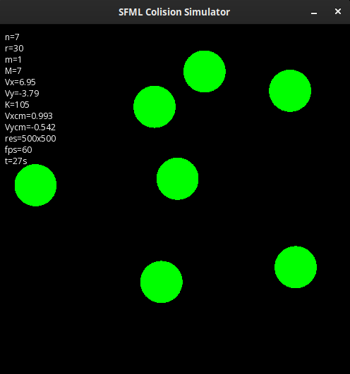

# SFML Colision Simulator

2D elastic colision simulator with SFML graphics library

<p align="center" width="100%">

</p>

## Build in Linux (Debian)
```sh
sudo apt install build-essential libsfml-dev pkgconf
make
```

## Run
```sh
make run
```
